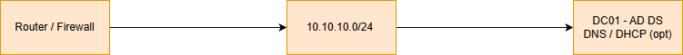

# Windows Enterprise Lab

Automated Windows Server lab for building an enterprise-style environment with Active Directory, DNS, DHCP (optional), and baseline Group Policy.

<p>


</p>

## Table of Contents
- [Overview](#overview)
- [Features](#features)
- [Topology](#topology)
- [Requirements](#requirements)
- [Deployment](#deployment)
- [Documentation](#documentation)
- [Scripts](#scripts)
- [Validation](#validation)
- [Status](#status)
- [Future Roadmap](#future-roadmap)

## Overview
This lab is designed for SMB-style environments to practice identity, automation, security baselines, and network administration in a controlled home lab.

## Features
- Automated domain deployment
- Baseline enterprise OU structure
- Optional DHCP server setup
- Security baseline Group Policies
- Documentation + runbooks included

## Topology
- 1 x Domain Controller (DC01)
- Subnet: `10.10.10.0/24`
- DNS Server: `10.10.10.10`

Simple topology:

```
[Router / Firewall] ---> [10.10.10.0/24] ---> [DC01 - AD DS, DNS / DHCP (opt)]
```

Detailed network diagrams:
docs/02-network-topology.md

<p align="center">

</p>

## Requirements
- Hyper-V, VMware, or Proxmox
- Windows Server 2019/2022 ISO
- Local admin on server
- PowerShell 5.1/7

## Deployment
See: docs/03-deployment-runbook.md

Quick start commands:

```powershell
Set-ExecutionPolicy RemoteSigned -Scope Process
cd C:\Lab
.\Deploy-ADDomain.ps1
.\PostDeploy-Baseline.ps1
```

## Documentation
Located in the `/docs` folder:

- [Lab Overview](docs/01-lab-overview.md)
- [Network Topology](docs/02-network-topology.md)
- [Deployment Runbook](docs/03-deployment-runbook.md)

## Scripts
Located in `/scripts`:

- [Deploy-ADDomain.ps1](scripts/Deploy-ADDomain.ps1)
- [PostDeploy-Baseline.ps1](scripts/PostDeploy-Baseline.ps1)
- [Validate-ADLab.ps1](scripts/Validate-ADLab.ps1)

## Validation
A validation script verifies:
- AD DS
- DNS zones
- DHCP configuration
- OU structure & GPOs applied

## Status
| Version | Stage | Notes |
|---------|-------|------|
| v1.0.0 | Complete | Base lab automation delivered |

## Future Roadmap
- VPN remote access (separate repo)
- SIEM + Sysmon logging repo
- Hybrid identity w/ Entra ID
